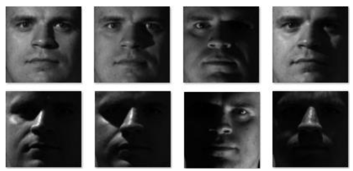

# ComputerVisionMainProject - Shadow Removal from Face Images In YaleB dataset

This project is about to work with UNet and removing shadow from faces.

Frontal and aligned images with a size of 160×160 from 10 individuals, each captured under 64 different lighting conditions, have been provided from the YaleB database.

According to the lighting angle, these images are classified into 5 different subsets, and the number of images in each subset is listed in the file Index.txt.</br>
Examples of some images from this dataset are shown in Figure 1. </br>




The unet architecture : 


The aim of this project was to give a shadowed image as the input to a neural network and provide the correct shadow-free image as the output, so that the network could learn the relationship between the two. Then, when a new shadowed image is given as input, the network attempts to reconstruct the shadow-free version.

In this project, I used the UNet neural network.

For preparing the training data:

- Each image from Subsets 3, 4, and 5 was paired with all the corresponding correct images from Subset 1, and the labels indicating which subset each image belongs to were also included. The dataset was structured as follows:

```
(image_path, mask_path, subset_name)
```
For preparing the test data:

- Each image from Subset 2 was placed in the test_dataset in the following format:

```
(image_test_path, subset_name)
```
The training and testing data were then passed into a Dataloader to prepare them for input to the neural network. The UNet model was trained using the training data.

All images were resized to a unified dimension of 512×256 and normalized. Each individual was considered as one class for UNet.

